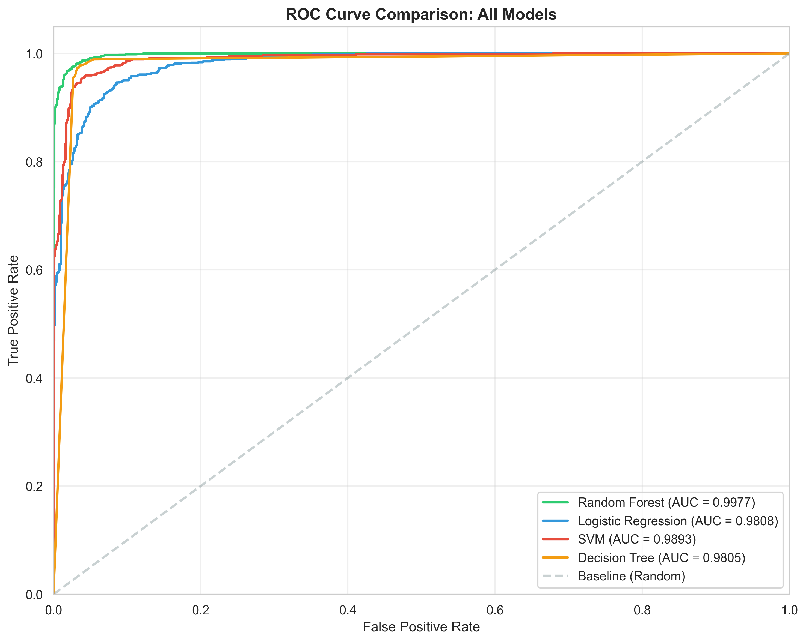
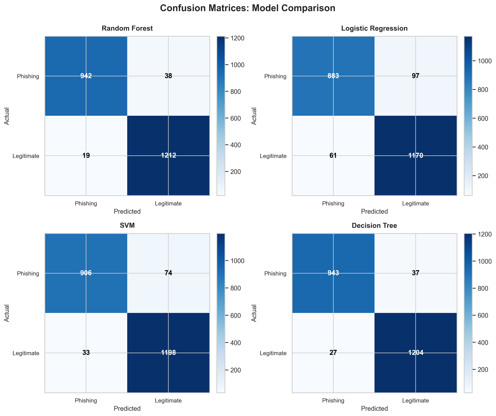
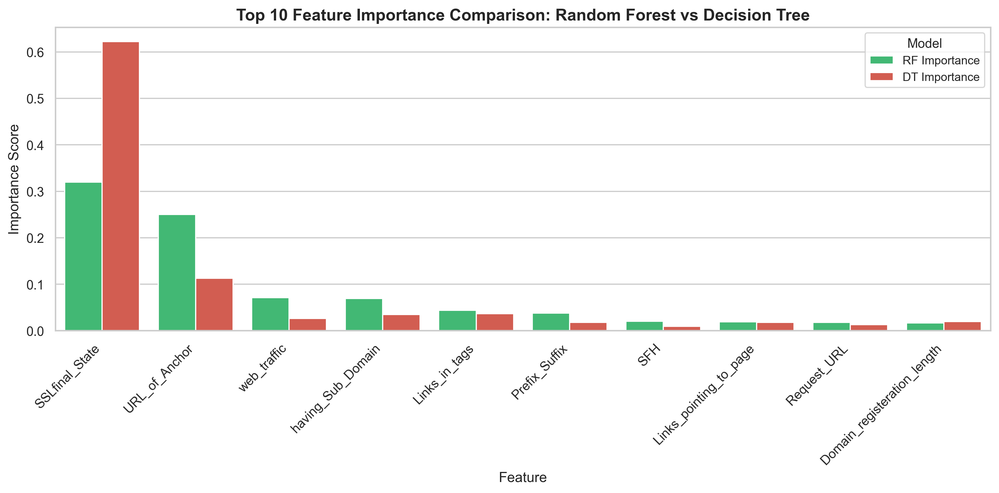
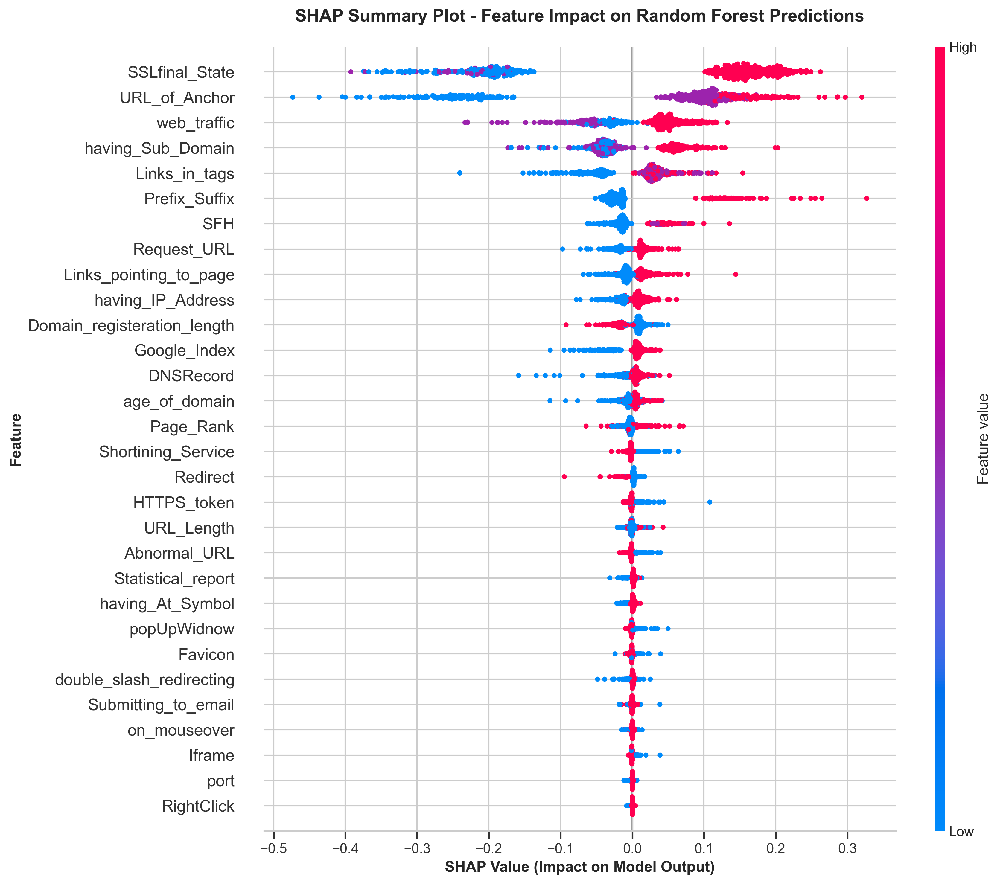
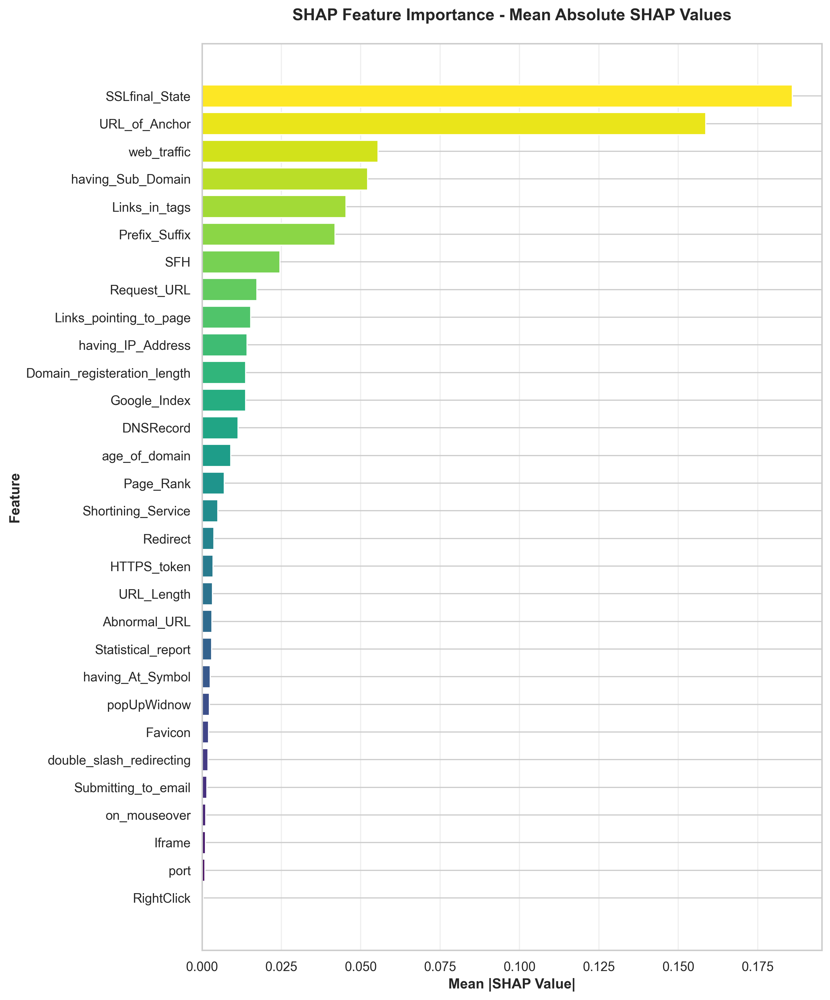

# Machine Learning and Explainable AI for Phishing Website Detection

Independent Research Project

## Overview

Phishing websites impersonate legitimate services to steal credentials and
personal information, and remain a persistent web security problem. This
project investigates whether conventional machine-learning classifiers can
distinguish phishing websites from legitimate ones using a standard set of
URL- and page-level features, and compares four widely used algorithms —
Random Forest, Decision Tree, Support Vector Machine, and Logistic
Regression — on this task. Beyond raw predictive performance, the project
places emphasis on model interpretability: feature importance and SHAP
analysis are used to examine which characteristics drive model predictions,
since a classifier's practical value depends not only on its accuracy but
on whether its reasoning can be inspected and understood. This repository
contains the analysis notebook, reusable preprocessing/training/evaluation
scripts, saved result tables, and the generated figures.

## Research Questions

1. How effectively can conventional machine-learning classifiers distinguish
   phishing websites from legitimate websites?
2. How does predictive performance differ among Random Forest, Decision
   Tree, SVM and Logistic Regression?
3. Which website characteristics contribute most strongly to phishing
   predictions?
4. Can explainability methods such as SHAP provide interpretable insight
   into model behaviour?

## Dataset

The [UCI Phishing Websites dataset](https://archive.ics.uci.edu/dataset/327/phishing+websites)
is used throughout. Each row represents a website described by 30
categorical features (encoded -1 / 0 / 1), with a binary target indicating
whether the site is phishing or legitimate.

| Property | Value |
|---|---|
| Samples | 11,055 |
| Predictive Features | 30 |
| Phishing | 4,898 |
| Legitimate | 6,157 |
| Missing Values | 0 |

An `id` column is present in the raw data and is excluded from modelling.
The dataset itself is not redistributed in this repository — see
[`data/README.md`](data/README.md) for how to obtain it and where to place
it locally.

## Methodology

```
Dataset
  ↓
Data quality checks (missing values, duplicates, class balance)
  ↓
Feature/target separation (id and Result columns dropped from X)
  ↓
Stratified 80/20 train-test split (random_state=42)
  ↓
Feature scaling (StandardScaler, fit on training data only)
  ↓
Model training (Random Forest, Decision Tree, Logistic Regression, SVM)
  ↓
Model evaluation (Accuracy, Precision, Recall, F1, ROC-AUC)
  ↓
Feature importance / SHAP explainability
```

All four models were trained with `random_state=42` and default (non-tuned)
hyperparameters, aside from `LogisticRegression(max_iter=1000)` to ensure
convergence. **No cross-validation and no hyperparameter optimisation were
performed** — this is a single stratified train-test split evaluation, and
the results below should be read with that in mind. Models were not
evaluated on any external or out-of-sample dataset beyond this split.

## Results

| Model | Accuracy | Precision | Recall | F1 | ROC-AUC |
|---|---|---|---|---|---|
| Random Forest | 0.9742 | 0.9743 | 0.9742 | 0.9742 | 0.9977 |
| Decision Tree | 0.9711 | 0.9711 | 0.9711 | 0.9710 | 0.9805 |
| SVM | 0.9516 | 0.9520 | 0.9516 | 0.9515 | 0.9893 |
| Logistic Regression | 0.9285 | 0.9287 | 0.9285 | 0.9284 | 0.9808 |

Random Forest produced the strongest predictive performance among the
evaluated models on the held-out test split, with Decision Tree close
behind. SVM and Logistic Regression trailed both tree-based methods,
consistent with this feature set containing non-linear patterns that a
linear decision boundary (Logistic Regression) captures less effectively.
These results are specific to this dataset, this train-test split, and this
set of (non-tuned) model configurations.




## Explainability

Feature importance was examined through three complementary lenses —
Random Forest importance, Decision Tree importance, and Logistic Regression
coefficient magnitude — alongside SHAP (SHapley Additive exPlanations)
values computed from the Random Forest model on a sample of the test set.
Across all of these methods, `SSLfinal_State` and `URL_of_Anchor` were
consistently among the most influential features, with `web_traffic`,
`having_Sub_Domain`, `Links_in_tags`, and `Prefix_Suffix` also ranking
highly. SHAP analysis in particular provides both a global ranking of
feature influence and, at the level of individual predictions, a way to
inspect why a specific website was classified as phishing or legitimate —
insight that raw feature-importance scores alone do not offer.

| Feature | SHAP Importance |
|---|---|
| SSLfinal_State | 0.1859 |
| URL_of_Anchor | 0.1587 |





## Key Findings

- Random Forest achieved 97.42% test accuracy and a 0.9977 ROC-AUC on this
  dataset and train-test split.
- Decision Tree produced similar accuracy (97.11%), with a lower ROC-AUC
  (0.9805) than the ensemble method.
- Predictive performance differed noticeably across the four algorithms
  evaluated, with the two tree-based methods outperforming SVM and Logistic
  Regression.
- `SSLfinal_State` and `URL_of_Anchor` consistently appeared among the most
  influential predictors across feature-importance and SHAP analyses.
- Explainability analysis provided insight into model behaviour beyond
  what aggregate classification metrics show on their own.

All findings above are conditional on this dataset and this experimental
setup; see [Limitations](#limitations).

## Repository Structure

```
phishing-website-detection/
├── README.md                  Project overview, methodology, results
├── LICENSE                    MIT license
├── requirements.txt           Python dependencies
├── .gitignore
├── notebooks/                 Full analysis notebook
├── src/                       Reusable preprocessing/training/evaluation/explainability scripts
├── results/                   Saved metric and feature-importance tables (CSV)
├── figures/                   Generated plots (confusion matrices, ROC curves, feature importance, SHAP, decision tree structure)
└── data/                      Dataset documentation (raw CSV not included)
```

## Reproducibility

```bash
git clone <repository-url>
cd phishing-website-detection

python -m venv .venv
```

Windows:
```bash
.venv\Scripts\activate
```

macOS/Linux:
```bash
source .venv/bin/activate
```

```bash
pip install -r requirements.txt
```

Then:

1. Obtain the dataset and place it at `data/uci-ml-phishing-dataset.csv`
   (see [`data/README.md`](data/README.md)).
2. To reproduce the full analysis interactively, open and run
   `notebooks/phishing_detection_analysis.ipynb` top to bottom.
3. To reproduce the core results from the command line instead, run the
   scripts in `src/` from the repository root:

   ```bash
   python src/train_models.py
   python src/evaluate_models.py
   python src/explainability.py
   ```

   `evaluate_models.py` writes an updated `results/model_comparison.csv`,
   and `explainability.py` writes updated `results/feature_importance.csv`
   and `results/shap_feature_importance.csv`. These scripts retrain the
   models directly (training takes seconds on this dataset), so no
   pre-trained model file needs to be shipped with the repository.

## Technologies

- Python
- Pandas
- NumPy
- scikit-learn
- Matplotlib
- Seaborn
- SHAP
- Joblib
- Jupyter Notebook

## Limitations

- This evaluation uses a single phishing dataset (UCI Phishing Websites);
  results have not been tested against other phishing datasets.
- Results may not generalise to modern or unseen phishing campaigns —
  phishing techniques evolve over time, and this dataset reflects a
  particular snapshot of website characteristics.
- The experiment uses a single stratified train-test split; no
  cross-validation was performed, so reported metrics carry some sampling
  variance that has not been quantified.
- No hyperparameter optimisation was performed for any model; reported
  results reflect default (or near-default) configurations rather than
  each model's best achievable performance.
- The dataset's 30 features (e.g. SSL state, URL structure, subdomain
  patterns) may not fully represent modern browser and web behaviour, and
  some features (e.g. `web_traffic`, `Page_Rank`) depend on third-party
  services whose availability and semantics can change over time.
- Strong performance on this dataset does not establish real-world,
  production-grade phishing detection performance; no external validation,
  live-traffic testing, or adversarial evaluation was conducted.

## Future Work

- External validation on additional, independently collected phishing
  datasets.
- Temporal evaluation on more recent phishing campaigns.
- Cross-dataset generalisation studies.
- Adversarial robustness analysis.
- Comparison with gradient boosting or deep learning approaches, where
  justified by problem complexity.
- Calibration and decision-threshold analysis.
- Additional explainability analysis (e.g. counterfactual explanations,
  per-class SHAP decomposition).

## Author

**Waleed Maqsood**
Master of Data Science, University of Southern Queensland (UniSQ)

GitHub: [waleedmaqsood20](https://github.com/waleedmaqsood20)
LinkedIn: [waleed-maqsood1](https://linkedin.com/in/waleed-maqsood1)

This repository documents an independent research project conducted to
explore machine-learning classification and explainability for phishing
website detection.
